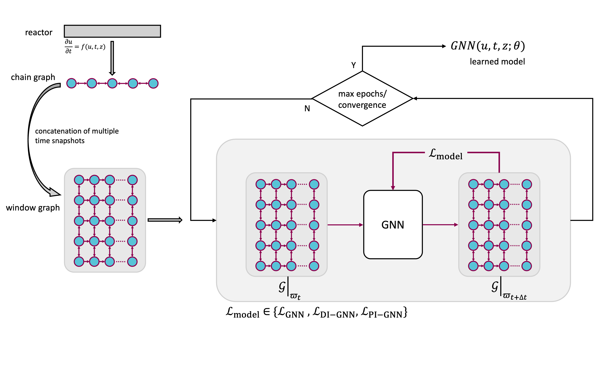
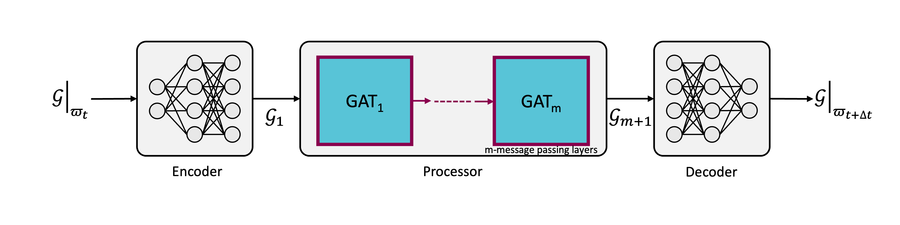

# Physics-Informed Graph Neural Networks for Modeling Spatially Distributed Dynamically Operated Processes
by Md Meraj Khalid, Luisa Peterson, Edgar Ivan Sanchez Medina, Kai Sundmacher


## Overview

This repository contains the code and data used for the analysis presented in the paper [Physics-Informed Graph Neural Networks for Modeling Spatially Distributed Dynamically Operated Processes](). The work explores different levels of physics integration in graph neural networks (GNNs) for modeling a catalytic CO2 methanation reactor.

*Generic schematic diagram of hybrid Graph Neural Networks*


*Network architecture of Graph Neural Networks*



## Repository Structure

```
├── data/                         # Data used in the study
├── models/                       # Trained models
├── reports/                      # Plots of loss trajectory, GNN predictions, etc
├── src/                          # Source code for data preprocessing, GNN architectures, model training and predictions + utilities
├── GNN_hyperparameter_optuna.py  # Script for hyperparameter optimization
├── GNN_run_ensemble.py           # Script for running an ensemble of simple GNN models
├── GNN_run.py                    # Script for data preprocessing, model (choose simple GNN, derivative-informed GNN, physics-informed GNN) building, training and testing pipeline as well as results evaluation and visualization
├── LICENSE                       # License information
├── README.md                     # This document
├── requirements.txt              # Required Python dependencies
```

## Citation

If you use this repository in your research, please cite our paper:

```
@article{mmkhalid_GNN2025,
  author    = {Md Meraj Khalid, Luisa Peterson, Edgar Ivan Sanchez Medina, Kai Sundmacher},
  title     = {Physics-Informed Graph Neural Networks for Modeling Spatially Distributed Dynamically Operated Processes},
  journal   = {},
  year      = {2025},
  doi       = {}
}
```

This work extends on the GNN implementation reported in [1], code available at [github.com/lsptrsn/surrogates_catalytic_reactor/](https://github.com/lsptrsn/surrogates_catalytic_reactor/).
[1] Luisa Peterson, Ali Forootani, Edgar Ivan Sanchez Medina, Ion Victor Gosea, Kai Sundmacher, and Peter Benner. Towards Digital Twins for Power-to-X: Comparing Surrogate Models for a Catalytic CO2 Methanation Reactor. TechRxiv. August 02, 2024. DOI: 10.36227/techrxiv.172263007.76668955/v1

## License

This project is licensed under the [MIT License](LICENSE.txt) - see the LICENSE file for details.

## Contact

For questions or collaborations, please feel free to reach out.
